# Working with Pipes

## Overview

For many data-analysis tasks it's easier to think about creating a _pipeline_ that data passes through rather than writing smaller blocks of code that store intermediate variables. For example rather than doing this, in which we create a bunch of intermediate variables:

```python
df = load('data-file')
cleaned = clean(df, fillna=0)
long = transform(cleaned)
summary = describe(long)
print(summary)
```

We can thinking about a sequences of function steps instead:

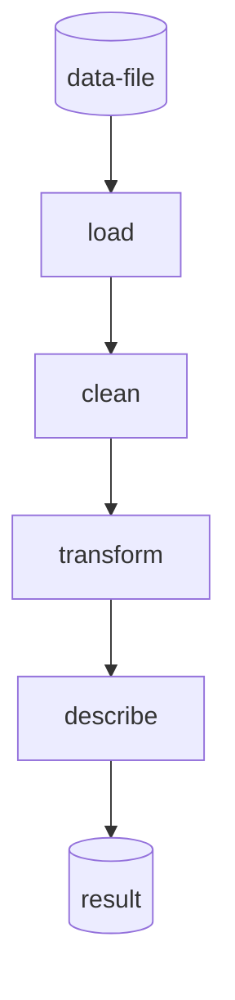

`utilz` is designed to make this kind of coding experience possible and easy. Its API optimizes for two primary things:

1. Reducing the number of intermediate variables you need to create
2. Reducing the number of ancillary functions you have create and maintain, by providing semantics for defining and using functions _inline_

The goals is to **minimize data polluting the global state** in notebooks and scripts making data analysis less error-prone and more reproducible. This minimizes the risk of outputs changing when you run cells/lines out of order. It also cleans up your code a bit and relieves you of the cognitive overhead of naming your variables well.

## Basics 

Lets start by importing what we need and generate some data. This data is from 20 individuals nested within one of 4 groups.

```python
from utilz import randdf
data = randdf((20,3))
data['group']  = ['a'] * 5 + ['b'] * 5 + ['c'] * 5 + ['d'] * 5
```

Let's see what it looks like to `pipe` this data through some operations. Here's the code and below is a visualization of what's happening:

```python
from utilz import pipe

pipe(
    data,
    lambda df: df.fillna(0),
    lambda df: df - df.mean().mean()
)
```

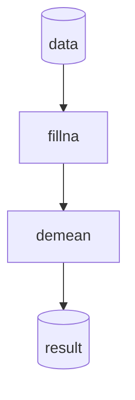

Every argument to `pipe` after the first is a function that is executed in sequence. Of course this is a contrived example as we could just chain together pandas operations instead: `data.fillna(0).apply(lambda df: df- df.mean().mean()))`. However, `pipe` in can work on any kind of input not just dataframes, making it a more general pattern for chaining operations.

## Widening pipes

`utilz` provides 2 functions to "widen" pipes, i.e. add/change outputs to the output of the previous step.

### Passing previous outputs forward with `alongwith`

Using `alongwith` we can "inject" additional data into the pipeline before the next function call. `alongwith` always takes a **single function** that should accept the output from the previous step. It always **returns a tuple** with the output of that function appended to the end:

```python
from utilz import alongwith
import itertools as it

pipe(
    data,
    alongwith(
        lambda df: list(it.combinations(df.Subject.unique(),2)),
    )
)
```

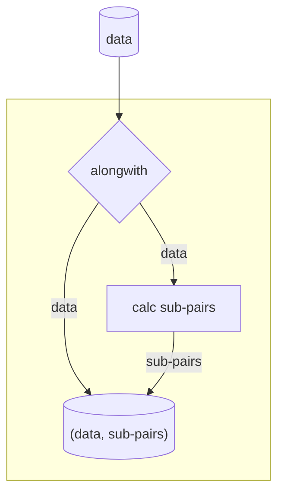

We can keep this going to add additional data into the pipelines. `alongwith` is smart enough to flatten out the tuple in successive calls. This is a very powerful semantic that lets you keep outputs from earlier in a `pipe` around, without needed to create temporary variables:

```python
pipe(
    data,
    alongwith(
        lambda df: list(it.combinations(df.Subject.unique(),2)),
    ),
    alongwith(
        lambda df: list(it.combinations(df.Conditions.unique(),3)),
    )
)
```


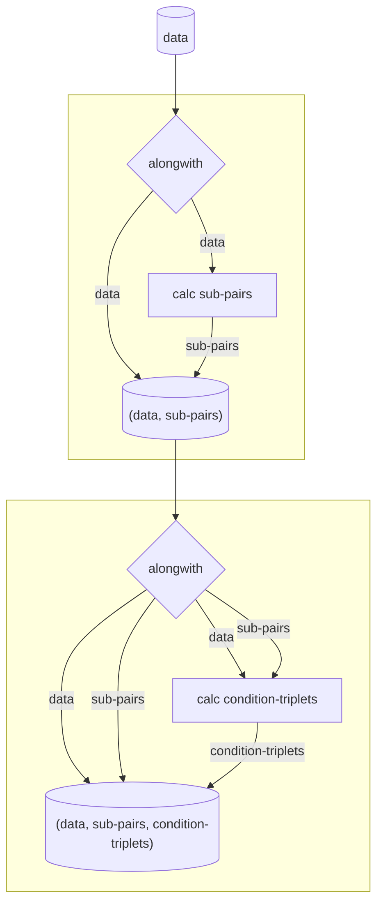

If the function passed to `alongwith` only takes 1 argument, then `alongwith` assumes you wanted the **first** value in the input which is the earliest value prior the first call of `alongwith` inside a `pipe`. So although the first `alongwith` returns a tuple `(data, sub_pairs)`, the second call to `alongwith` received a function with only 1 arg leading `alongwith` to only receive `data`. 

If you want to access *all* the previous outputs, simply use a function that can handle that many outputs:

```python
pipe(
    data,
    alongwith(
        lambda df: list(it.combinations(df.Subject.unique(),2)),
    ),
    alongwith(
        lambda df, pairs: df.assign(pairs=pairs)
    )
)
```

### Duplicating (+transforming) outputs with `spread`

`utilz` also supports a more general semantic called `spread`. By passing in one or more functions, `spread` will pass an **independent copy of each previous output to each function**. This is similar to a `map`, but rather than mapping 1 function to multiple values in an iterable, we map *multiple functions*:

```python
from utilz import spread

pipe(
    data,
    # each func expects a dataframe
    spread(
        sine_filter,
        gamma_filter,
        band_filter
        )
)
```

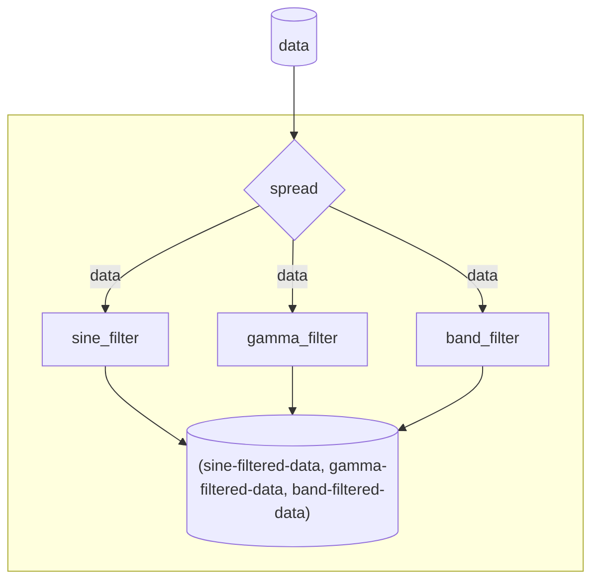

Spreading it useful when you want to run _one input through multiple functions_ or **one-to-many**. You can see how `spread` is a more general form of `alongwith` because you can simply pass a no-op/identity functions as one of the arguments to pass previous outputs forward (`alongwith` offers cleaner usage):

```python
pipe(
    data,
    spread(
        lambda df: df,
        sine_filter,
        gamma_filter,
        band_filter
        )
)
```

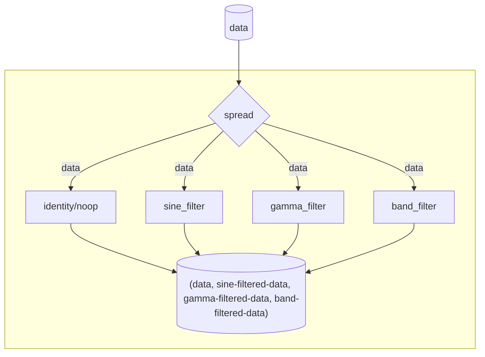

### `alongwith` vs `spread`

The primary way to think about the difference between `spread` and `alongwith` is the following:

- Use `alongwith` when the next function in your pipe expects the output from one or more functions ago
  - this allows you to store "state" in a different way
- Use `spread` when you need to run two or more independent sub-pipelines
  - this allows you to avoid having to create multiple `pipe`s with the same input data
  - if you simply need to create copies you can use `fork` which takes an integer 


## Handling multiple outputs with the `map` family

`utilz` offers multiple functions that operate on *iterables* which all begin with `map`. Here's a quick rundown:

- `map`: apply a function to each element 
- `mapcat`: concatenate the results of a `map` into a squeezed array or dataframe
- `mapcompose`: apply multiple functions in sequence to each element, passing the previous evaluation into the next function 
- `mapmany`: apply multiple functions to each element, but keep their evaluations independent
- `mapacross`: apply one function to each element in matching pairs

Here are some examples:

```python
from utilz import mapcompose, curry, mapcompose
import seaborn as sns

pipe(
    data,
    spread(
        sine_filter,
        gamma_filter,
        band_filter
        ),
    mapcompose(
        lambda df: df.groupby('group').agg('mean'),
        lambda dfagg: dfagg.corr()
    ) # Like running each transformed copy of data through a mini-pipe
)
```

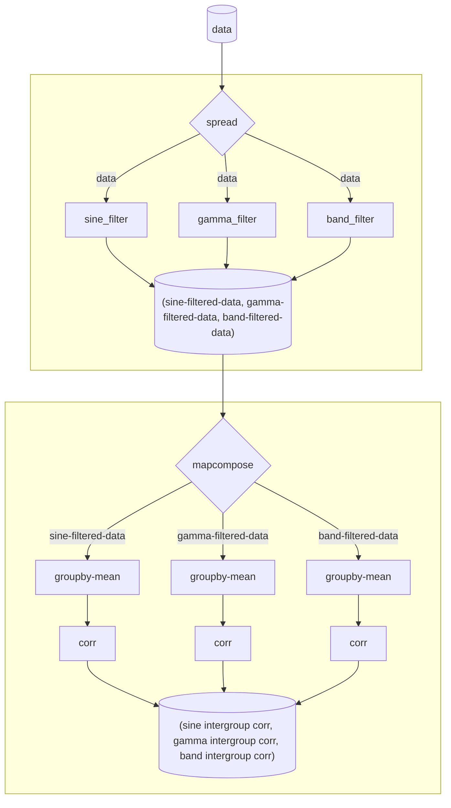

Sometimes you don't want to run each element through a function, but rather run function element pairs. You can accomplish this with `mapacross`: 

```python
from utilz import mapacross

pipe(
    data,
    spread(
        sine_filter,
        gamma_filter,
        band_filter
        ),
    mapacross(
        lambda df: df.groupby('group').agg('mean')
        lambda df: df.groupby('group').agg('median')
        lambda df: df.groupby('group').agg('mode')
    ) # expect 3 functions as there are 3 transformed copies of data
)
```


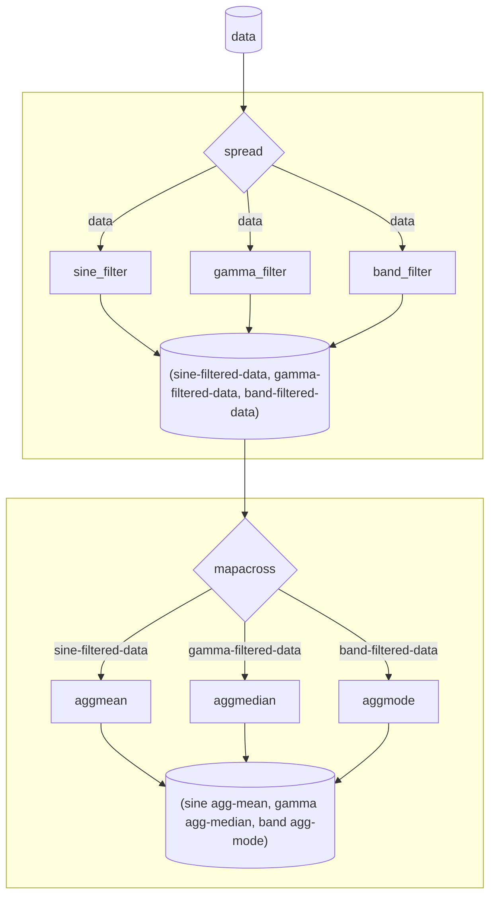

### Condensing pipes with `gather`

The other idiom `utilz` supports is simply `gather`-ing up all the previous outputs so they're more conveniently accessible by the next step in the `pipe` which should make use of one ore more of these outputs:

```python
from utilz import gather, map
import numpy as np

pipe(
    data,
    spread(
        sine_filter,
        gamma_filter,
        band_filter
        ),
    map(
        lambda df: df.groupby('group').agg('mean'),
    ),
    # contrived example
    gather(lambda sine, gamma, band: (sine * 2) / (gamma + band))
)
```

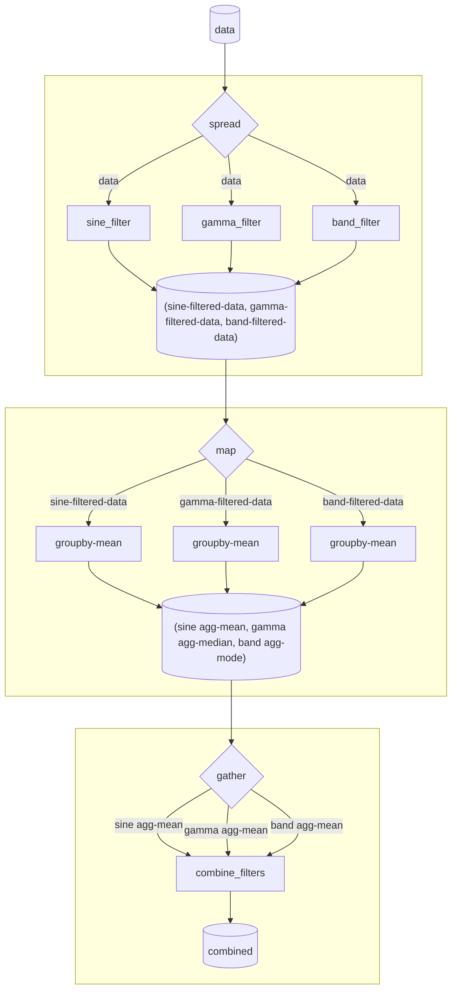

This saves you from having to write any tuple unpacking code in the `combine` function, which can make inlining-lambdas much clunkier as your function gets complicated:

```python
pipe(
    data,
    spread(
        sine_filter,
        gamma_filter,
        band_filter
        ),
    map(
        lambda df: df.groupby('group').agg('mean'),
    ),
    # harder to understand going on
    lambda tup: tup[0] * 2 / (tupe [1] + tup[2])
)
```


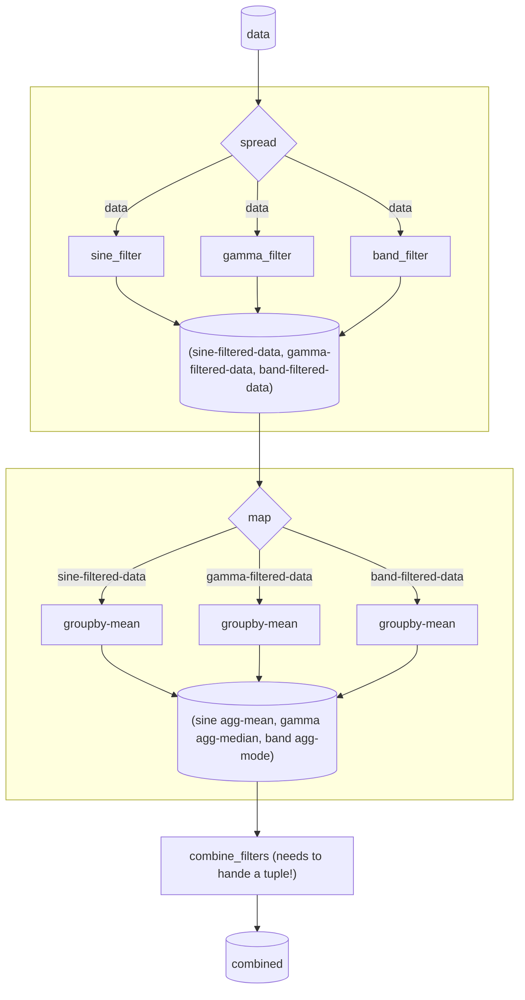

For some operations that expect a tuple/list skip `gather`:

```python
pipe(
    data,
    spread(
        sine_filter,
        gamma_filter,
        band_filter
        ),
    mapcompose(
        lambda df: df.groupby('group').agg('mean'),
    ),
    # Don't need to gather; concat wants a lists/tuple
    lambda tup: pd.concat(tup)
        .assign(filter=lambda df: np.repeat(['sine', 'gamma', 'band'] * df.shape[0] / 3)
        .groupby('filter')
        .agg('std'))
)
```

Of course `gather` works with any output that's a tuple or list such, as the outputs of `alongwith` and `spread`:


```python
pipe(
    data,
    alongwith(
        lambda df: list(it.combinations(df.Subject.unique(),2)),
    ),
    # (data, sub-pairs)
    alongwith(
        lambda tup: list(it.combinations(tup[0].Conditions.unique(),3)),
    ),
    # (data, sub-pairs, condition-triplets)
    gather(
        lambda data, sub_pairs, condition_triplets: (
            pd.concat([sub_pairs, condition_triples], axis=1)
            .value_counts()
        )
)
```

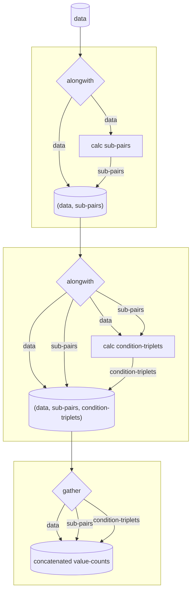

## Modifying `pipe`'s behavior

To make life easier `pipe` offers several semantics for controlling what gets displayed and returned. A good rule of thumb is that **everything inside a `pipe` is always evaluated.** So the functionality described here is just manipulating those evaluations in some specific way. There are no supported semantics for "partially" evaluating anything inside a `pipe`. 

### Controlling what `pipe` returns

You can use the following flags to control what `pipe` returns and thus what can be assigned to a variable:

- `output (default True)`: return the final result of the pipe, typically the last function evaluation (but see [ellipses](#ellipses))
- `flatten (default False)`: assuming output is an iterable, tries to unnest 1 layer of iterable nesting
- `keep (default None)`: an integer or list of integers that can be used to slice the output of `pipe` assuming the output is iterable. Useful for discarding outputs you don't want or need.

#### Ellipses

`pipe` supports a special semantic using the `...` operator in python. This is a valid and unique token that can be passed in place of a function. When `pipe` sees this it **flags the current output to be the final output of the `pipe` regardless of any values after `...`**. This can be useful for running functions that have side-effects but don't return as the terminal step in a pipe, but still getting back the previous computations. 

Here's an illustrative example where we munge some data and then print some summary information to the screen. Because the `print` function doesn't return anything, if we used it as the last step in our pipe our `results` would be `None`:

```python
import utilz.dfverbs as _ # dataframe tools

results = pipe(
    DATA_DIR / "data.csv",
    _.read_csv(),
    _.fillna(0),
    _.replace(" ", 0),
    _.query(lambda df: ~df.SID.isin(EXCLUDED_SUBS)),
    _.query("Condition != 'C'"),
    _.mutate(
        Rank=lambda df: df.Rank.astype(int), # Ensure numeric int types
        Was_Recalled=lambda df: df.Rank.apply(lambda x: 1 if x > 0 else x), # binarize based on cut-off
    ),
    lambda df: print(
        f"""
           Num participants: {df.SID.nunique()}
            Num cues: {df.groupby('Category').Cue.nunique()}
            Num chars per participant: {df.groupby('SID').size().unique()}
            """
    ), # print() always returns None so thats the last function evaluation in pipe!
)

results is None # True
```

Instead we can use `...` to mark where we want our `pipe` to return from, regardless of what comes after:

```python

results = pipe(
    DATA_DIR / "data.csv",
    _.read_csv(),
    _.fillna(0),
    _.replace(" ", 0),
    _.query(lambda df: ~df.SID.isin(EXCLUDED_SUBS)),
    _.query("Condition != 'C'"),
    _.mutate(
        Rank=lambda df: df.Rank.astype(int), # Ensure numeric int types
        Was_Recalled=lambda df: df.Rank.apply(lambda x: 1 if x > 0 else x), # binarze based on cut-off
    ),
    ..., # now we return the output of _.mutate() regardless of any funcs after this point!
    lambda df: print(
        f"""
           Num participants: {df.SID.nunique()}
            Num cues: {df.groupby('Category').Cue.nunique()}
            Num chars per participant: {df.groupby('SID').size().unique()}
            """
    ), # print() always returns None
)

isinstance(results, pd.DataFrame) # True
```

This is an extremely powerful way to make several things more convenient in a *single `pipe`*. While it's tempting to test the possibilities, in practice its much more useful to **keep `pipe` simple**.

That being said there are some common data analysis patterns where `...` can be useful:

- preprocessing data and saving it as a variable, but *also* additionally processing that data to make plotting easier, and then generating and saving the plot 

```python

by_sum, by_mean = pipe(
    data,
    _.groupby("SID"),
    _.apply(
        lambda s: s.pivot(values="Was_Recalled", index="List", columns="Cue"),
        reset_index="reset",
    ),
    # Up to here we've just performed some reshaping to generate vstacked List x Cue dfs per SID 
    _.groupby("List"),
    many(
        lambda df: df.sum()[CUE_ORDER],
        lambda df: df.mean()[CUE_ORDER],
    ), # many runs 2 independent copies of our grouped data through each function so we get a tuple with 2 elements back
    ..., # this tuple is what gets output and unpacked into by_sum and by_mean
    map(_.heatmap(cmap="Blues")), # but we can keep going and generate a heatmap for the summed and averaged dataframes!
    mapacross(
        tweak(title="Number of Participants", xlabel=None, ylabel=None),
        tweak(title="Proportion of Participants", xlabel=None, ylabel=None),
    ), # we can operate on each plot in parallel and give them different titles
    mapacross(
        savefig(path=FIG_DIR, name="char_by_cue_sum"),
        savefig(path=FIG_DIR, name="char_by_cue_mean"),
    ), # and finally save them to different files without affecting the output at all!
)

```

### Saving and loading `pipe` output

You can use the following flags to control I/O with pipes:

- `save (default False)`: will call the `.to_csv()` method on the output of the pipe or each element of the output if the output is a list/tuple
- `load_existing default False)`: only works when `save` is being used. Will try to load the results at the path provided to `save` thus **bypassing `pipe` evaluation entirely**. Set to `False` will always overwrite the results at the path provided to `save`.

### Controlling what `pipe` displays

You can use the following flags to control how `pipe` behaves in interactive sessions like IPython consoles or Jupyter notebooks:

- `show (default False)`: print or display the the final result of the pipe. This is useful, because you can assign the result of your pipe to a variable but still see what you're assigning without having to create another line of code/code-cell, e.g.

```python
# This
m = pipe([1,2,3], np.mean, show=True)

# is equivalent to this
m = pipe([1,2,3], np.mean)
m
```

## Debugging `pipe`

Sometimes it can be hard to track intermediate values/state when a `pipe` gets long or complicated. In general: **this is a good indication to split up your `pipe`**. Just save a subset of steps as a separate variable. You can always refactor multiple pipes later. 

Set `debug=True` when running a `pipe` to do 2 things:

1. Ignores all other flags such as saving and loading
2. Saves the evaluation of every step to a list and returns that list

This will consume more memory as each intermediate value will now be assigned to a list item, but this can be extremely helpful in seeing what's going on.

