# Working with Pipes

## Overview

For many data-analysis tasks it's easier to think about creating a _pipeline_ that data passes through rather than writing smaller blocks of code that store intermediate variables. For example rather than doing this, in which we create a bunch of intermediate variables:

```python
df = load('data-file')
cleaned = clean(df, fillna=0)
long = transform(cleaned)
summary = describe(long)
print(summary)
```

We can thinking about a sequences of function steps instead:

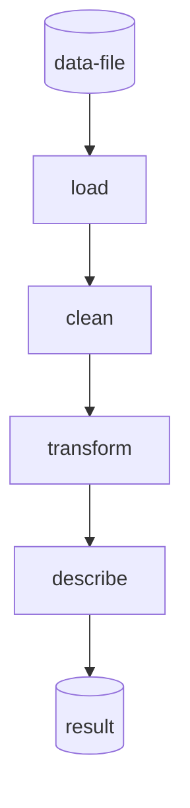

`utilz` is designed to make this kind of coding experience possible and easy. Its API optimizes for two primary things:

1. Reducing the number of intermediate variables you need to create
2. Reducing the number of ancillary functions you have create and maintain, by providing semantics for defining and using functions _inline_

The goals is to **minimize data polluting the global state** in notebooks and scripts making data analysis less error-prone and more reproducible. This minimizes the risk of outputs changing when you run cells/lines out of order. It also cleans up your code a bit and relieves you of the cognitive overhead of naming your variables well.

## Basics 

Lets start by importing what we need and generate some data. This data is from 20 individuals nested within one of 4 groups.

```python
from utilz import randdf
data = randdf((20,3))
data['group']  = ['a'] * 5 + ['b'] * 5 + ['c'] * 5 + ['d'] * 5
```

Let's see what it looks like to `pipe` this data through some operations. Here's the code and below is a visualization of what's happening:

```python
from utilz import pipe

pipe(
    data,
    lambda df: df.fillna(0),
    lambda df: df - df.mean().mean()
)
```

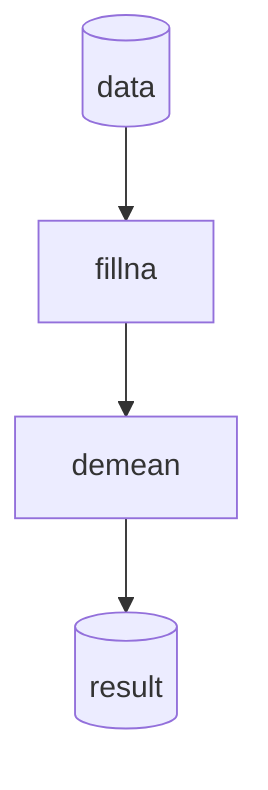

Every argument to `pipe` after the first is a function that is executed in sequence. Of course this is a contrived example as we could just chain together pandas operations instead: `data.fillna(0).apply(lambda df: df- df.mean().mean()))`. However, `pipe` in can work on any kind of input not just dataframes, making it a more general pattern for chaining operations.

## Widening pipes

`utilz` provides 2 functions to "widen" pipes, i.e. add/change outputs to the output of the previous step.

### Passing previous outputs forward with `append`

Using `append` we can "inject" additional data into the pipeline before the next function call. `append` always takes a **single function** that should accept the output from the previous step. It always **returns a tuple** with the output of that function appended to the end:

```python
from utilz import append
import itertools as it

pipe(
    data,
    append(
        lambda df: list(it.combinations(df.Subject.unique(),2)),
    )
)
```

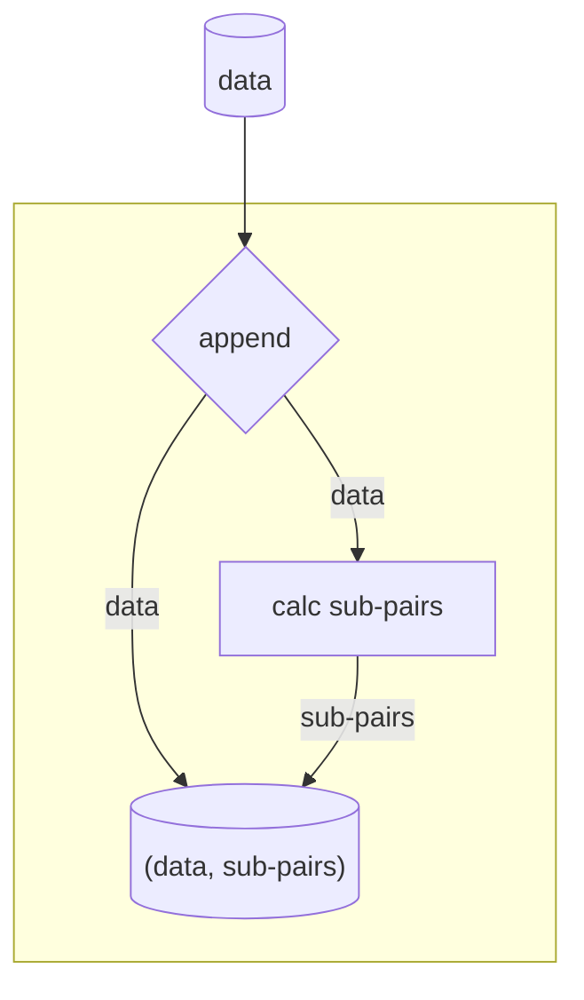

We can keep this going to add additional data into the pipelines. `append` is smart enough to flatten out the tuple in successive calls. This is a very powerful semantic that lets you keep outputs from earlier in a `pipe` around, without needed to create temporary variables:

```python
pipe(
    data,
    append(
        lambda df: list(it.combinations(df.Subject.unique(),2)),
    ),
    append(
        lambda df: list(it.combinations(df.Conditions.unique(),3)),
    )
)
```


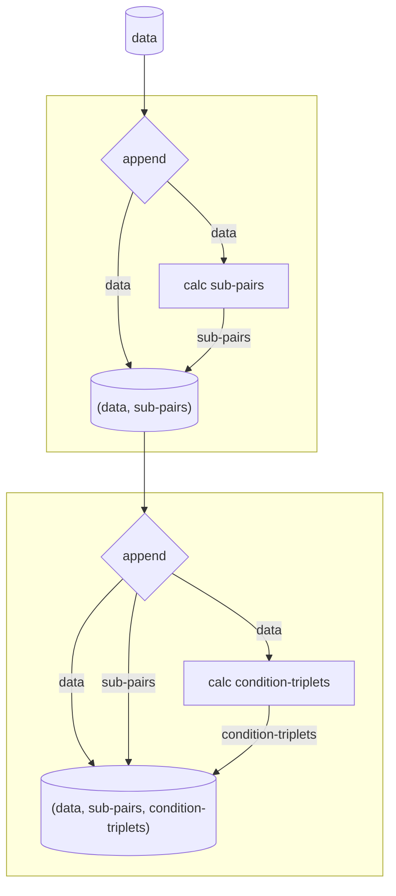

### Duplicating (+transforming) outputs with `spread`

`utilz` also supports a more general semantic called `spread`. By passing in one or more functions, `spread` will pass an **independent copy of each previous output to each function**. This is similar to a `map`, but rather than mapping 1 function to multiple values in an iterable, we map *multiple functions*:

```python
from utilz import spread

pipe(
    data,
    # each func expects a dataframe
    spread(
        sine_filter,
        gamma_filter,
        band_filter
        )
)
```

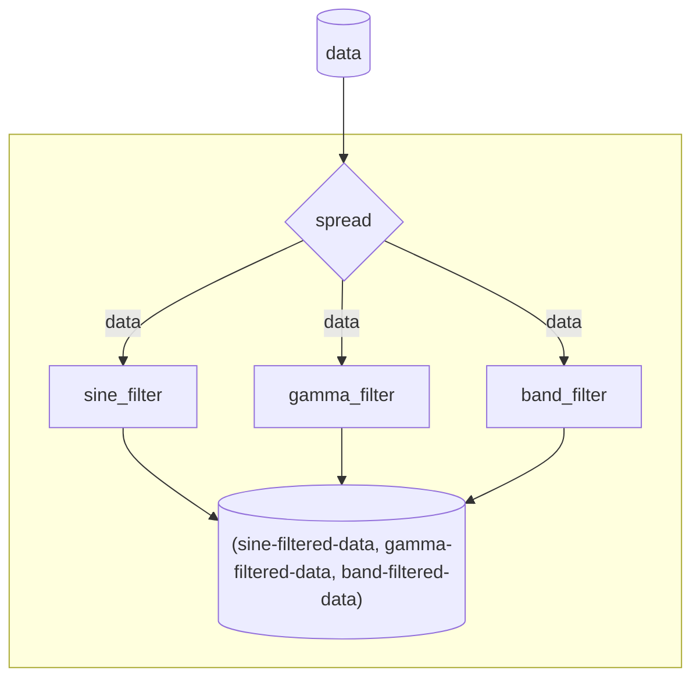

Spreading it useful when you want to run _one input through multiple functions_ or **one-to-many**. You can see how `spread` is a more general form of `append` because you can simply pass a no-op/identity functions as one of the arguments to pass previous outputs forward (`append` offers cleaner usage):

```python
pipe(
    data,
    spread(
        lambda df: df,
        lambda df: sine_filter(df),
        lambda df: gamma_filter(df),
        lambda df: band_filter(df),
        )
)
```

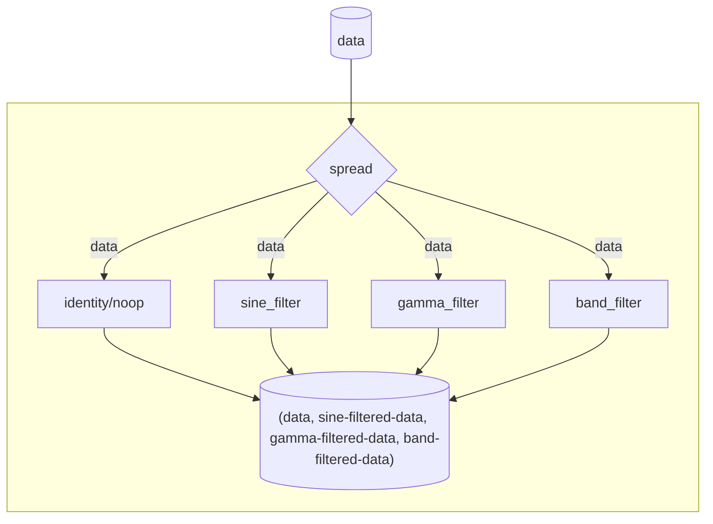

## Handling multiple outputs

`utilz` offers 2 way to handle multiple outputs from any step in a `pipe` , regardless of whether that's because of how your function works or because you used `append` or `spread`.

### Keeping outputs separated with `separate`

To continue processing outputs **independently** of each other use `separate`. It expects one or more functions that will be applied to each output with no data sharing between function evaluations:

```python
from utilz import separate
from toolz import curry
import seaborn as sns

pipe(
    data,
    spread(
        lambda df: sine_filter(df),
        lambda df: gamma_filter(df),
        lambda df: band_filter(df),
        ),
    separate(
        lambda df: df.groupby('group').agg('mean'),
        lambda dfagg: dfagg.corr()
    )
)
```

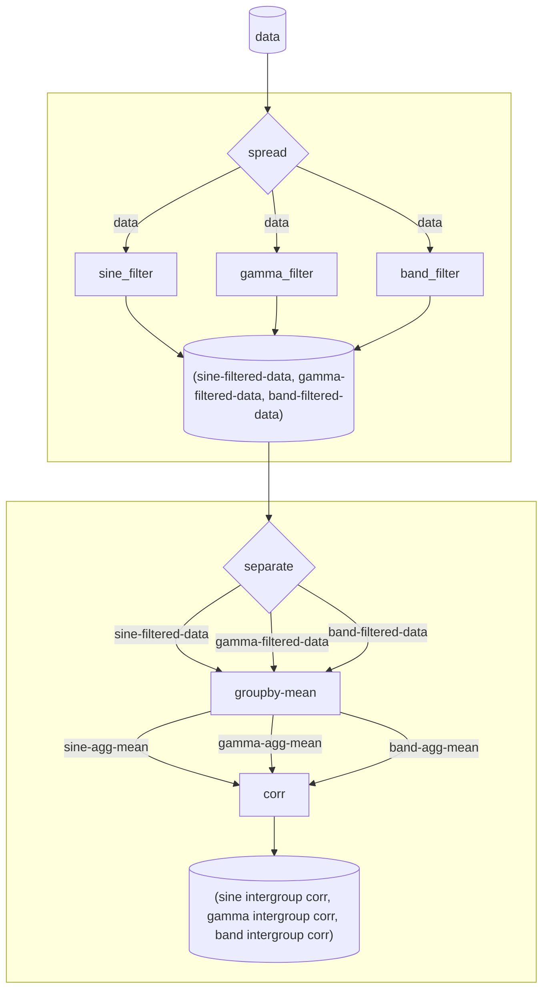

If `separate` is passed `match = True` and the number of functions equals the number of outputs from the previous step, each function will be applied to each output as a pair rather than each function executing on each input:

```python
pipe(
    data,
    spread(
        lambda df: sine_filter(df),
        lambda df: gamma_filter(df),
        lambda df: band_filter(df),
        ),
    separate(
        lambda df: df.groupby('group').agg('mean')
        lambda df: df.groupby('group').agg('median')
        lambda df: df.groupby('group').agg('mode')
    )
)
```


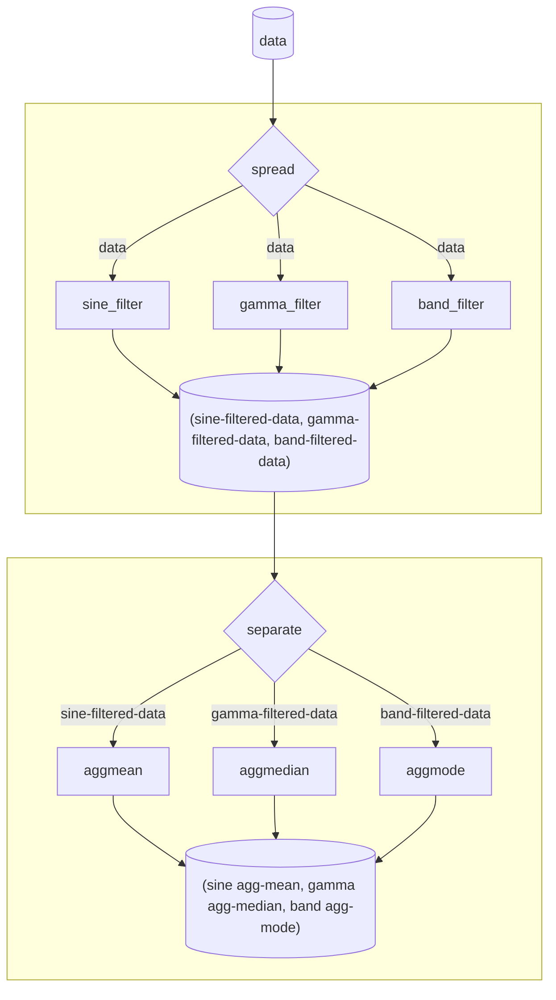

### Condensing pipes with `gather`

The other idiom `utilz` supports is simply `gather`-ing up all the previous outputs so they're more conveniently accessible by the next step in the `pipe` which should make use of one ore more of these outputs:

```python
from utilz import gather
import numpy as np

pipe(
    data,
    spread(
        lambda df: sine_filter(df),
        lambda df: gamma_filter(df),
        lambda df: band_filter(df),
        ),
    separate(
        lambda df: df.groupby('group').agg('mean'),
    ),
    # contrived example
    gather(lambda sine, gamma, band: (sine * 2) / (gamma + band))
)
```

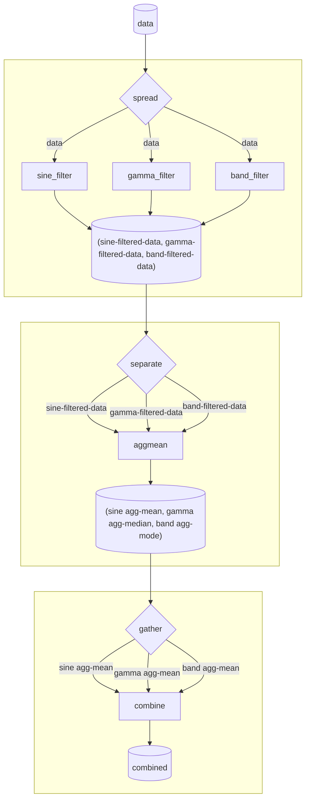

This saves you from having to write any tuple unpacking code in the `combine` function, which can make inlining-lambdas much clunkier as your function gets complicated:

```python
pipe(
    data,
    spread(
        lambda df: sine_filter(df),
        lambda df: gamma_filter(df),
        lambda df: band_filter(df),
        ),
    separate(
        lambda df: df.groupby('group').agg('mean'),
    ),
    # harder to understand going on
    lambda tup: tup[0] * 2 / (tupe [1] + tup[2])
)
```


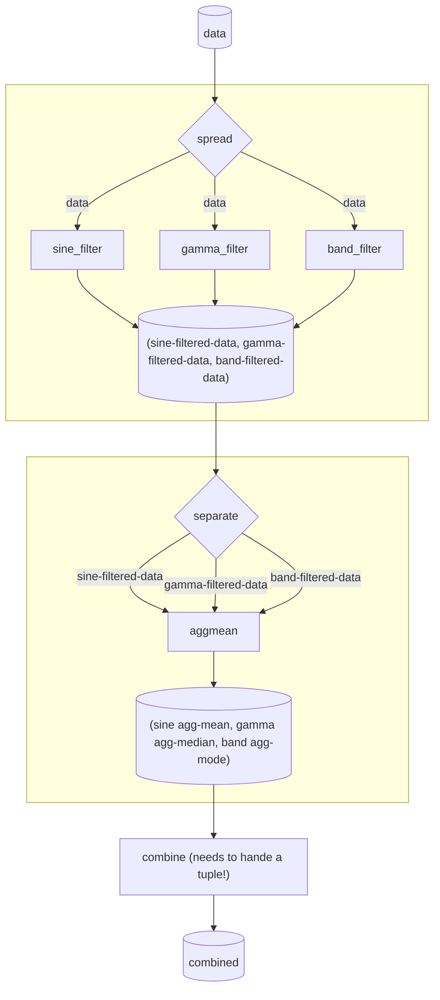

Of course for some operations a tuple is totally fine and you don't really need `gather`:

```python
pipe(
    data,
    spread(
        lambda df: sine_filter(df),
        lambda df: gamma_filter(df),
        lambda df: band_filter(df),
        ),
    separate(
        lambda df: df.groupby('group').agg('mean'),
    ),
    # Don't need to gather
    lambda tup: pd.concat(tup)
        .assign(filter=lambda df: np.repeat(['sine', 'gamma', 'band'] * df.shape[0] / 3)
        .groupby('filter')
        .agg('std'))
)
```

Of course `gather` works with any output that's a tuple or list such as the outputs of `append` and `spread`:


```python
pipe(
    data,
    append(
        lambda df: list(it.combinations(df.Subject.unique(),2)),
    ),
    # (data, sub-pairs)
    append(
        lambda df: list(it.combinations(df.Conditions.unique(),3)),
    ),
    # (data, sub-pairs, condition-triplets)
    gather(
        lambda data, sub_pairs, condition_triplets: (
            pd.concat([sub_pairs, condition_triples], axis=1)
            .value_counts()
        )
)
```

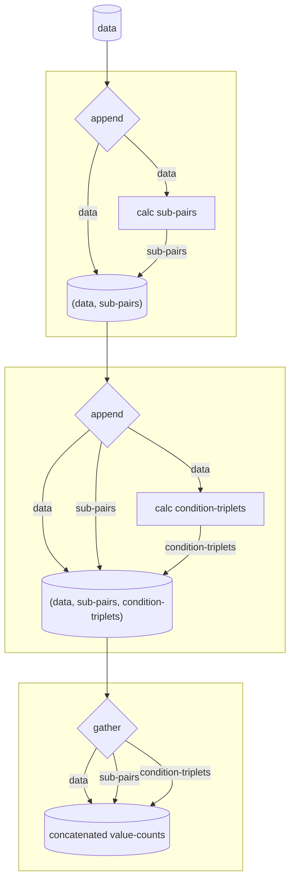

## `append` vs `spread`

The primary way to think about the difference between `spread` and `append` is the following:

- Use `append` when the next function in your pipe expects the output from one or more functions ago
  - this allows you to store "state" in a different way
- Use `spread` when you need to run two or more independent sub-pipelines
  - this allows you to avoid having to create multiple `pipe`s with the same input data
